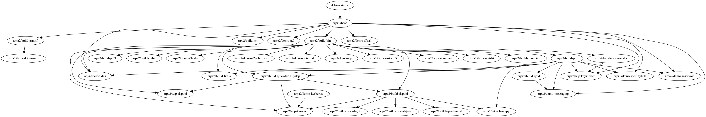

# Docker Demos for ARPA2

These are demonstration images based on Docker.
They are a basis for our own development, and for
sharing the results.

Dependencies are shown in the graphic below.



## Quick start

To see a usage video in your console, run

```shell
script -p demo-identityhub.script
```

To build the images, run

```shell
build.sh
```

The directories contain individual README files.
Generally, the `demo-*` directories are targets
and `wip-*` is work in progress.  The `build-*`
are helpful temporary images during building;
we build stuff in them and then `COPY --from`
to a target image.

## Adding images

Please commit a new demo as `wip-*` until it can
actually be tried, at which time it moves to
`demo-*` -- this may save some disappointments.

You can create a typescript console "video" with

```shell
script -r <imagename>.script
```

To recreate the dependency graphs, there is a simple
scripted procedure,

```shell
./deps.sh > deps.dot
dot -T png deps.dot > deps.png
```

Perhaps it is helpful to do even this work in
CMake.
